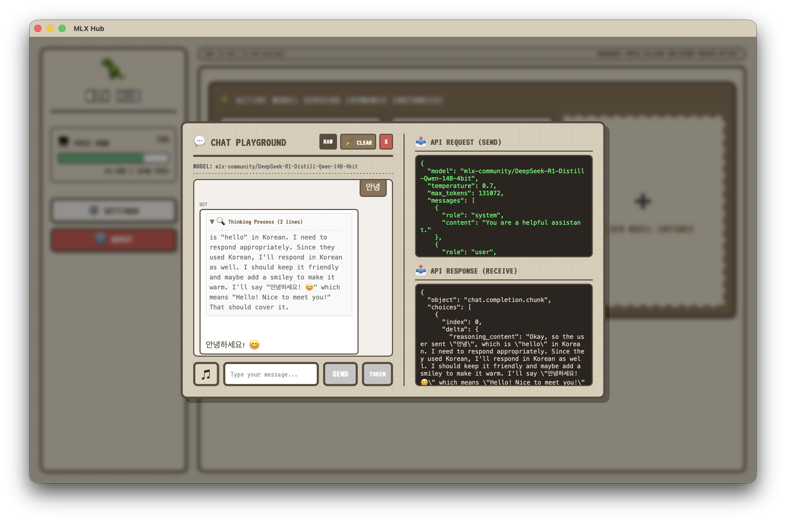

# MLX Hub ⚡️

Mac 사용자를 위한 가장 직관적이고 가벼운 로컬 AI (LLM / Vision) 서버 매니저입니다. Apple Silicon (M1/M2/M3/M4) 칩셋의 하드웨어 가속 성능을 100% 활용하여 빠르고 쾌적하게 로컬 AI 모델을 구동할 수 있습니다.

---

## 📥 원클릭 빠른 터미널 설치 (추천)
터미널을 열고 아래 명령어를 복사하여 입력하면 다운로드부터 설치, Gatekeeper 우회 설정까지 한 번에 완료됩니다.

```bash
curl -sSL https://raw.githubusercontent.com/Gorita/mlx-hub-release/main/setup.sh | bash
```

> [!IMPORTANT]
> 원클릭 설치 스크립트는 최신 `.dmg` 파일을 자동으로 다운로드하여 마운트하고, `/Applications` 폴더로 앱을 복사한 뒤, 보안 격리 속성 해제까지 한 단계로 모두 자동 대행합니다.

---

## 🎨 스크린샷

### 1. 메인 대시보드 (서버 관리 및 슬롯)


### 2. 채팅 플레이그라운드 & API 요청 뷰어


---

## ✨ 주요 기능
- **클릭 한 번으로 모델 구동:** 번거로운 터미널 명령어 없이 픽셀 테마의 깔끔한 UI에서 모델을 검색하고 실행하세요.
- **내 Mac 사양에 맞는 스마트 추천:** 내 Mac의 RAM 용량을 실시간으로 분석하여 끊김 없이 돌아가는 최적의 모델을 추천해 드립니다.
- **Apple Silicon 완벽 최적화:** `mxfp8`, `OptiQ-4bit` 등 Mac 하드웨어(NPU) 가속을 100% 활용하는 최신 포맷을 기본 지원합니다.
- **백그라운드 트레이 지원:** 메뉴바 아이콘을 통해 방해받지 않고 언제든 AI 서버 상태를 모니터링하고 제어할 수 있습니다.

---

## ⚠️ 수동 설치 시 주의사항 (DMG 직접 설치)
수동으로 `.dmg` 파일을 열어 설치하는 경우 최초 실행 시 "앱이 손상되었기 때문에 열 수 없습니다"라는 경고가 나타날 수 있습니다. 
이는 macOS의 Gatekeeper 보안 정책 때문이며, 터미널을 열고 아래 명령어를 한 줄 입력하시면 정상적으로 실행됩니다.

```bash
xattr -d com.apple.quarantine /Applications/mlx-hub.app
```

---

## 📡 외부 앱 연동 가이드 (Developer Guide)

외부 앱(예: `daddy-keep-working` 등)에서 MLX Hub를 제어하거나 상태를 구독하려면 다음 UDS 및 URI 규격을 사용하십시오.

### 1. 앱 실행 트리거 (Custom URI Scheme)
앱이 설치된 경우, 아래 스킴을 호출하여 앱을 활성화하거나 실행할 수 있습니다.
- **URI Scheme**: `mlx-hub://`
- **사용 예시 (Terminal)**: `open mlx-hub://`

### 2. 실시간 상태 구독 (Unix Domain Socket)
MLX 서버의 상태가 변경될 때마다 실시간으로 데이터를 푸시받을 수 있습니다.
- **소켓 경로**: `/tmp/mlx-hub.sock`
- **데이터 형식**: Newline-delimited JSON (NDJSON)
- **통신 플로우**:
  1. 소켓 연결 즉시 **현재 최신 상태** 1회 수신.
  2. 이후 서버 시작/정지/설치 등 **상태 변화 발생 시마다** 새로운 JSON 패킷 수신.
- **전송 데이터 예시**:
  ```json
  {"status":{"kind":"ready"},"model":"mlx-community/gemma-4-e2b-it-qat-OptiQ-4bit","port":8765}
  ```

---

## 📄 License
이 소프트웨어의 실행 파일 및 스크립트는 **MIT License** 하에 제공됩니다.
소프트웨어 배포 파일 자체를 자유롭게 사용할 수 있으나, 저작권 고지서를 포함해야 합니다.

Copyright (c) 2026 GORITA. All rights reserved.
